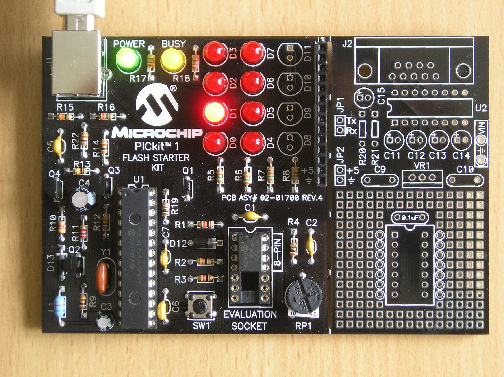

# USB PICkit 1 programmer

This is a little text-based utility to control the very cheap and simple
Microchip(tm) PICkit(tm) 1 FLASH Starter Kit device programmer from Linux.



## Introduction

The PICkit is a small PCB that connects to your USB port and allows you to
upload programs to the flash memory of 8-pin and 14-pin Microchip PICs.
It has 8 LEDs as output, a push button connected to a digital input,
and a potentiometer connected to the analog input.

## Usage

```
pickit1 [OPTION]

where OPTION can be:

  -p, --program=<file>     Writes .hex file to chip
  -x, --extract=<file>     Read from chip into .hex file
  -v, --verify=<file>      Read from chip and compare with .hex file
  -b, --blankcheck         Read chip, check all locations for 1 or blank
  -e, --erase              Erase device.  Preserve OscCal and BG Bits if
                           implemented
  -m, --memorymap          Show device Program and EE Data Memory
  -c, --config             Show configuration data
  -r, --reset              Power cycle the chip
  --off                    Turn chip power off
  --on                     Turn chip power back on
  --oscoff                 Turn 2.5 kHz osc off, leave chip on
  --oscon                  Turn 2.5 kHz osc on, with chip on
  --bandgap=<int>          Erase device.  Preserve OscCal and write specified
                           BG Bits
  --osccalregen            Erase device.  Regenerate OscCal using autocal.hex
  --programall=<file>      Overwrite OscCal and BG (dangerous!)

<file> is an Intel MDS .hex file; the standard format used by almost
all compilers, assemblers, and disassemblers.

```

NOTE: the program needs the `autocal.hex` file for the `--osccalregen` option.
You'll need to run the program in the same directory where `autocal.hex` is
if you want to use this option.

## Compiling

There is no configure script, just type:

	make

You'll need libraries and development files of libusb (`libusb-dev`) and libpopt (`libpopt-dev`).
The program is known to work with libusb >= version 0.10.

This programmer should work for any Linux kernel >= 2.6.15.
It was developped and tested with Ubuntu 6.06 and 6.10.
The latest version was developed with Debian 13 stable (Trixie).

## Examples

The file `default.hex` contains the PIC12F675 default demo program shipped with the PICkit1.
It flashes the 8 LEDs in sequence. A button press changes the direction of the flashing.
The speed of flashing is controlled by the potentiometer.

You can find some examples for the PIC 12F675 and 16F684 in the `example` directory:

 - blink: Alternately flashes LEDs D0 and D1.
 - blink8: Alternately flashes the eight LEDs D0 to D7.
 - switch: Switches between LEDs D0 and D1 when SW1 is pressed.
 - switch8: Switches between LEDs D0 to D7 when SW1 is pressed.
 - timer8: Let the eight LEDs D0 to D7 flash alternately using an internal timer.
